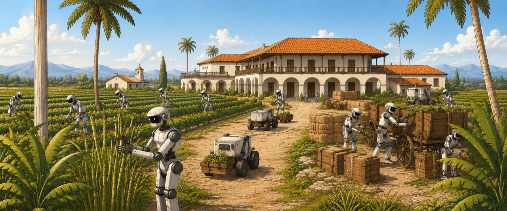
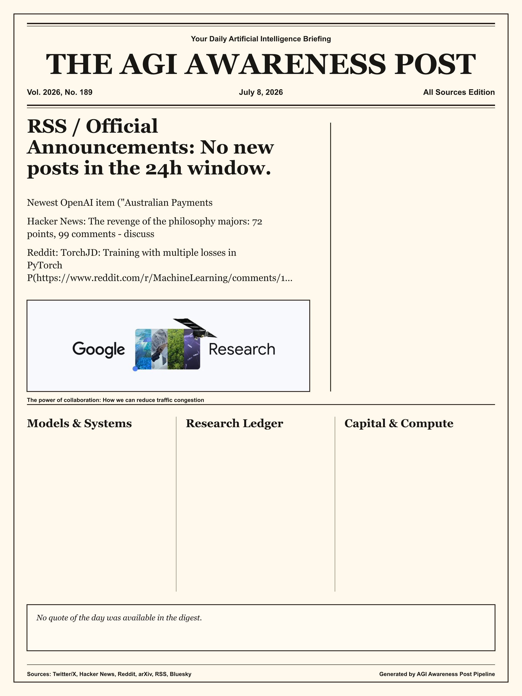
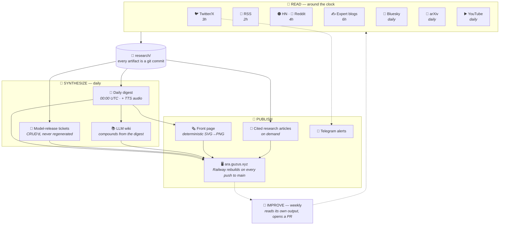
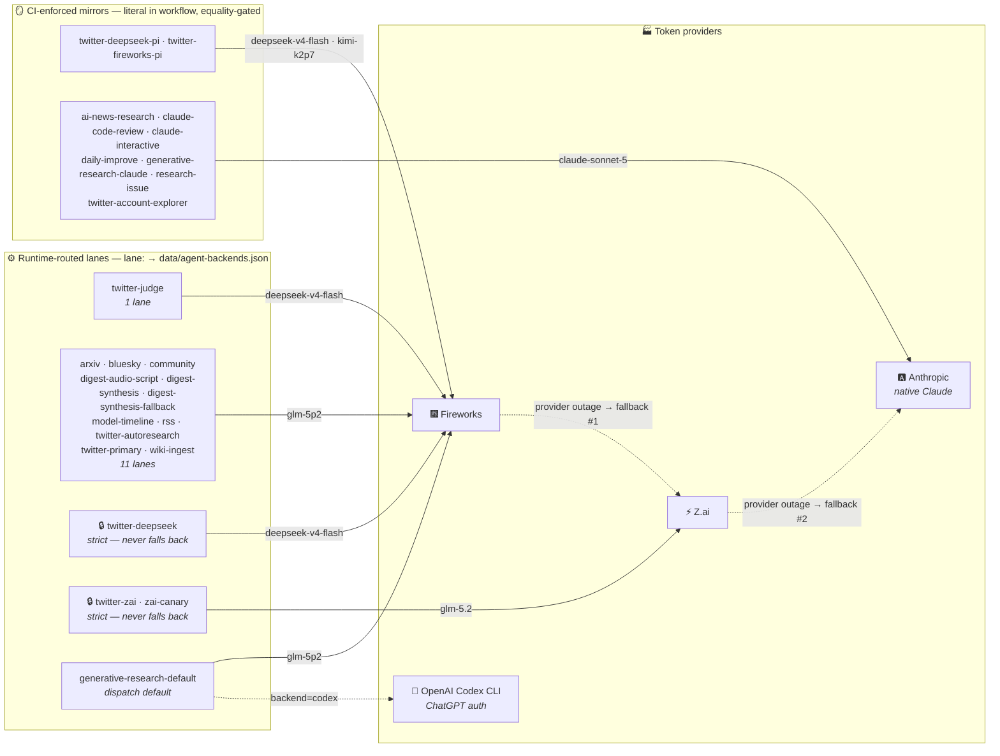

# AI Research Arm

**The AI newspaper that writes itself.** Every few hours, a fleet of LLM agents
reads the AI firehose — Twitter/X, RSS, Hacker News, Reddit, Bluesky, arXiv,
expert blogs, YouTube. Every night it writes the paper: a synthesized digest, a
rendered front page, a model-release timeline, a compounding wiki. Every week
it opens a pull request to improve its own methodology. The only human in the
loop reviews the PRs.

[](https://github.com/guzus/ai-research-arm/actions/workflows/ci.yml)
[](https://ara.guzus.xyz)
[](LICENSE)
[](https://github.com/guzus/ai-research-arm/commits/main)

Running unattended since January 2026: **23 GitHub Actions workflows** have
committed **1,400+ research artifacts** — 110+ daily digests, 60+ long-form
cited articles, a 115-ticket model-release timeline, and a 58-page wiki — all
deployed continuously to **[ara.guzus.xyz](https://ara.guzus.xyz)**.

📖 [Why this is open source](https://guzus.substack.com/p/open-sourcing-ai-research-arm-ara) ·
[What's changed since the post](docs/since-the-open-sourcing-post.md) ·
[Operator's manual](CLAUDE.md)

## Today's Front Page

<!-- FRONT_PAGE_START -->

<!-- FRONT_PAGE_END -->

> 🗞️ Rendered every day at 00:30 UTC from the digest — deterministic SVG→PNG,
> no model in the render path. [Interactive edition](https://ara.guzus.xyz/frontpage) ·
> [archive](research/front-page/)

## What it publishes

| Output | Cadence | Live | Source of truth |
|---|---|---|---|
| 🗞️ **Front page** — the day's digest as a newspaper | daily 00:30 | [/frontpage](https://ara.guzus.xyz/frontpage) | [`research/front-page/`](research/front-page/) |
| 📰 **Daily digest** — all-source synthesis, with TTS audio | daily 00:00 | [/today](https://ara.guzus.xyz/today) | [`research/digest/`](research/digest/) |
| 🎫 **Model timeline** — one CRUD'd ticket per release, funding round, or legal fight | daily | [/models](https://ara.guzus.xyz/models) | [`research/models/tickets/`](research/models/tickets/) |
| 📚 **LLM wiki** — compounding knowledge base; one page per entity, concept, theme | daily, post-digest | [/wiki](https://ara.guzus.xyz/wiki) | [`research/wiki/`](research/wiki/) |
| 🔬 **Generative research** — long-form, heavily-cited articles in a custom DSL | on demand | [/research](https://ara.guzus.xyz/research) | [`research/generative/`](research/generative/) |
| 🐦 **Twitter reports** — from a reviewed, self-expanding account manifest | every 3h | [/twitter](https://ara.guzus.xyz/twitter) | [`research/twitter/`](research/twitter/) |
| 📣 **Headline alerts** — deduped breaking-news pings | every 3h | Telegram | [`research/summaries/`](research/summaries/) |

Recent articles the pipeline researched, wrote, validated, and published by
itself: *"Reward Hacking at Scale"*, *"Meta Compute: the surplus that reprices
the neocloud"*, *"Anthropic vs the Pentagon: the unprecedented
supply-chain-risk label"* — [browse all](https://ara.guzus.xyz/research).

## Quickstart (no accounts needed)

Prerequisites: [Bun](https://bun.sh) and [Git LFS](https://git-lfs.com) — the
committed front-page images are stored with Git LFS, so a `git clone` with
git-lfs installed hydrates them automatically (the dashboard prebuild fails on
unhydrated LFS pointers).

The dashboard builds and runs against the sample research data already
committed in this repo — no API keys or secrets required:

```bash
cd dashboard
bun install
bun run dev          # local dev server at http://localhost:5173
# or: bun run build  # production build into dashboard/dist/
```

Python tooling is stdlib-first and managed with [uv](https://docs.astral.sh/uv/):

```bash
uv sync --all-extras
uv run python -m unittest discover -s scripts -p 'test_*.py'
```

Running the **full data pipeline** needs your own credentials and
infrastructure — see [What you can run vs. what needs accounts](#what-you-can-run-vs-what-needs-accounts).

## Architecture

Read → synthesize → publish → improve. Every artifact at every stage is a git
commit, so the entire history of the pipeline's "mind" is diffable.



The dashboard is a Vite + Bun + TypeScript SPA. On every push to `main`,
Railway rebuilds the root [`Dockerfile`](Dockerfile) (bun build → Caddy serve,
behind Cloudflare); `dashboard/scripts/prebuild.mjs` copies `research/` into
the site before Vite runs. There is no deploy workflow — publishing research
*is* deploying.

## Backend routing

Which model serves each lane — and where it falls back on a provider
outage — is defined in one file:
[`data/agent-backends.json`](data/agent-backends.json). Scheduled lanes
resolve it at runtime (editing the file re-routes them with no workflow
change); the diagram below is generated from it and CI-checked so it can't
drift. Full per-lane matrix: [`docs/backend-matrix.md`](docs/backend-matrix.md).

<!-- BEGIN GENERATED BACKEND DIAGRAM (scripts/build_backend_matrix.py — do not edit by hand) -->

_Generated from [`data/agent-backends.json`](data/agent-backends.json) — fallback chain: `zai-glm-5p2` → `claude`; regenerate with `uv run python scripts/build_backend_matrix.py`._
<!-- END GENERATED BACKEND DIAGRAM -->

## Sources

| Source | Method | Frequency |
|--------|--------|-----------|
| **Twitter/X** | Birdy read-only multi-fetch (reviewed account manifest + 7 searches) | Every 3 hours |
| **RSS feeds** | Direct XML fetch (OpenAI, Anthropic, DeepMind, TechCrunch, …) | Every 2 hours |
| **Hacker News** | MCP server | Every 4 hours |
| **Reddit** | RSS feeds (r/MachineLearning, r/LocalLLaMA, r/artificial) | Every 4 hours |
| **Expert blogs** | Curated KOL/researcher/operator feed registry | Every 6 hours |
| **Bluesky** | Public API | Daily |
| **arXiv** | MCP + RSS | Daily |
| **YouTube** | tuber API discovery + read-only summaries/transcripts | Daily |
| **Web search** | Exa/Perplexity MCP (optional) | On demand |

The Twitter account manifest ([`data/sources/twitter_accounts.json`](data/sources/twitter_accounts.json))
is itself agent-curated: a weekly explorer lane scouts for high-signal
accounts — favoring ones vouched for by accounts already monitored, and
on-topic for AI over merely viral — and opens a reviewed PR when the evidence
is strong. Contract: [`docs/twitter-account-curation.md`](docs/twitter-account-curation.md).

## Workflows

All 23 workflows live in [`.github/workflows/`](.github/workflows/). The
interesting ones:

**Aggregate** — raw signal in, markdown out

| Workflow | Schedule | Output |
|---|---|---|
| `hourly-twitter.yml` | every 3h | `research/twitter/` + Telegram headline alerts (plus DeepSeek/pi comparison tiers) |
| `hourly-rss.yml` | every 2h | `research/rss/` |
| `4h-community.yml` | every 4h | `research/community/` (HN + Reddit) |
| `daily-ai-blogs.yml` | every 6h | `research/blogs/` |
| `2h-bluesky.yml` | daily | `research/bluesky/` |
| `daily-arxiv.yml` | daily | `research/arxiv/` |
| `daily-youtube.yml` | daily | `research/youtube/` |
| `twitter-account-explorer.yml` | weekly | reviewed PRs against the account manifest |

**Synthesize** — read everything, write the record

| Workflow | Schedule | Output |
|---|---|---|
| `daily-digest.yml` | daily 00:00 UTC | `research/digest/` + TTS audio |
| `24h-model-timeline.yml` | daily | CRUDs `research/models/tickets/` + daily diff |
| `wiki-ingest.yml` | after the digest | updates `research/wiki/` from the *curated* synthesis |
| `ai-news-research.yml` | twice daily | broad topic sweep via Perplexity/Exa MCP |

**Publish** — shareable artifacts

| Workflow | Trigger | Output |
|---|---|---|
| `daily-front-page.yml` | daily 00:30 UTC | newspaper PNG + interactive edition |
| `generative-research.yml` | issue label or dispatch | long-form cited article |
| `research-issue.yml` | `research` issue label | report posted back to the issue |

**Keep it honest** — the pipeline watching itself

| Workflow | Trigger | Purpose |
|---|---|---|
| `daily-improve.yml` | weekly Mon | reads its own output, opens a methodology PR |
| `liveness-check.yml` | scheduled | per-lane freshness watchdog, runs on *both* runner tiers |
| `auto-rerun-on-runner-loss.yml` | on failure | re-runs jobs whose ephemeral worker vanished (loop-capped) |
| `ci.yml` | push/PR | actionlint + dashboard build + Python tests |
| `claude.yml` / `claude-code-review.yml` | `@claude` / PR | interactive agent + automated review |

```mermaid
gantt
    title Daily Workflow Schedule (UTC)
    dateFormat HH:mm
    axisFormat %H:%M

    section Every 2h
    RSS Feeds           :crit, 00:30, 2h

    section Every 3h
    Twitter/X           :active, 00:07, 3h

    section Every 4h
    Community (HN+Reddit) :00:19, 4h

    section Every 6h
    Expert Blogs        :00:13, 6h

    section Twice Daily
    AI News Research    :08:23, 1h

    section Daily
    YouTube Signal      :23:20, 1h
    Bluesky             :00:11, 1h
    arXiv Papers        :06:13, 1h
    Daily Digest        :00:00, 1h
    Self-Improve        :milestone, 00:17, 0h
```

<details>
<summary>📅 Daily schedule as a Gantt chart</summary>



</details>

## Research on demand

Three ways to commission work from the pipeline:

**1. Issue → research report.** Open a GitHub issue, add the `research` label.
The agent acknowledges it, researches with web search + MCP tools, commits a
report to `research/issues/`, and posts the findings back on the issue.

**2. Topic → published article.** Label an issue `gen-research` or dispatch
`generative-research.yml` with a `topic`. The agent researches primary
sources, writes in the [ARA DSL](ARA_DSL.md) (a validated component language
— see [Component catalog](COMPONENTS.md)), and publishes through a single
writer path that re-validates everything before commit. Defaults to GLM 5.2
via Fireworks; `backend=claude|codex|deepseek-v4-flash` selects other
providers ([details](docs/generative-research-backends.md)).

**3. Tweet → verified article.** Give it just a tweet URL — it reads the
thread, infers the underlying research question, then verifies the claims
against independent primary sources before writing:

```bash
gh workflow run generative-research.yml \
  -f twitter_url="https://x.com/<handle>/status/<id>"
```

## Built to keep running

The interesting engineering is less "call an LLM" and more "survive every way
this can break":

- **Deterministic fallbacks.** Every scheduled lane has a model-free composer
  (`scripts/deterministic_*_digest.py`) that writes the day's artifact from
  already-fetched data when the agent path fails. A provider outage never
  means a missing daily file.
- **Output contracts.** Agent lanes must *prove* their work:
  [`require-output`](.github/actions/require-output) asserts the expected
  artifacts changed, and [`require-diff-scope`](.github/actions/require-diff-scope)
  asserts nothing outside the declared paths was committed.
- **Sandboxed agents.** Claude Code runs under a fail-closed bubblewrap policy
  ([`.claude/settings.json`](.claude/settings.json)) — no host credentials, no
  unsandboxed shell. Comparison lanes on other harnesses run in containers.
- **Provider failover.** One SSOT file routes every lane across
  Fireworks / Z.ai / Anthropic / Codex with an ordered fallback chain — and CI
  fails if docs or workflows drift from it.
- **Watchdogs that outlive the fleet.** Freshness checks run on both runner
  tiers so an outage on either still alerts; a loop-safe auto-rerunner
  recovers jobs whose ephemeral Cloud Run worker vanished mid-run.
- **CRUD, not regenerate.** The model timeline and wiki are persistent stores
  with immutable slugs and append-only history, schema-validated on every PR
  — knowledge compounds instead of being rewritten nightly.
- **Self-improvement with review.** The weekly improve lane reads the
  pipeline's own output and opens PRs — it can propose anything, but a human
  merges.

## What you can run vs. what needs accounts

This repo is one person's live pipeline, published as-is. Much of it is
reproducible; some of it points at the maintainer's private infrastructure and
is included for transparency rather than turnkey reuse.

**Runs with no accounts:**
- The **dashboard** — builds and serves from the sample data committed under
  `research/` (see [Quickstart](#quickstart-no-accounts-needed)).
- The **Python tooling + tests** — stdlib-first, `uv`-managed; validators and
  unit tests run offline.

**Needs your own credentials (drop-in):**
- **Claude / Codex / Fireworks / Z.ai backends** — set
  `CLAUDE_CODE_OAUTH_TOKEN`, `CODEX_AUTH_JSON`, `FIREWORKS_API_KEY`, or
  `ZAI_API_KEY` for the synthesis/generative lanes you want to run on your
  fork. The Codex lane uses ChatGPT-managed auth, not OpenAI API billing.
- **Twitter/X lanes** — supply your own `BIRD_AUTH_TOKEN` / `BIRD_CT0` cookies
  (they expire often; lanes degrade to empty data without them).
- **Exa / Perplexity** search enrichment and **Gemini** TTS are optional.

**Maintainer-specific (swap or disable to self-host):**
- **Runners:** nearly every workflow targets a private self-hosted Cloud Run
  fleet (`runs-on: [self-hosted, Linux]`); on a fork those jobs queue until you
  point them at your own runners (or change `runs-on`).
- **Services:** `hooker.guzus.xyz` (telemetry — no-ops if `HOOKER_URL` is
  unset), `tuber-api.guzus.xyz` (YouTube signal — no public equivalent), and
  `s3.guzus.xyz` (audio hosting). Override the non-secret endpoints via the env
  vars in [`.env.example`](.env.example) (`AUDIO_BASE_URL`,
  `POSTBUILD_SITE_ORIGIN`, `DEPLOY_HEALTH_URL`, …).
- **Deploy:** production is a Railway service watching `main`, and
  `ara.guzus.xyz` is the maintainer's domain. The static dashboard shell also
  embeds a Google Analytics tag in `dashboard/index.html` — remove it on a fork.
- **Sibling repos** `../oracle` and `../runner` referenced in the docs are
  private and not required for the default Claude/Codex/Fireworks paths.

### Secrets

All credentials are injected via GitHub Actions secrets (or a local `.env`,
which is gitignored) — see [`.env.example`](.env.example) for the full
annotated list. None are needed for the
[Quickstart](#quickstart-no-accounts-needed).

| Secret | Required for | Description |
|--------|--------------|-------------|
| `CLAUDE_CODE_OAUTH_TOKEN` | native-Claude lanes + fallback path | Claude Code auth |
| `FIREWORKS_API_KEY` | default scheduled lanes (GLM 5.2, DeepSeek, Kimi) | Anthropic-compatible Fireworks endpoint |
| `ZAI_API_KEY` | Z.ai GLM 5.2 lanes | Z.ai Coding Plan, Anthropic-compatible route |
| `CODEX_AUTH_JSON` | `generative-research backend=codex` | file-backed ChatGPT Codex auth from `codex login`; treat like a password |
| `BIRD_AUTH_TOKEN` / `BIRD_CT0` | Twitter/X lanes | X cookies (read-only use; expire often) |
| `BIRDY_ACCOUNTS` | optional | multi-account rotation JSON; every account forced read-only |
| `GEMINI_API_KEY` | digest/article audio | price-performant TTS |
| `EXA_API_KEY` / `PERPLEXITY_API_KEY` | optional | neural + cited web search via MCP |
| `TELEGRAM_BOT_TOKEN` / `TELEGRAM_CHAT_ID` | headline alerts | delivery channel |

<details>
<summary>Output directory layout</summary>

```
research/
├── arxiv/          # daily papers
├── blogs/          # expert-blog digests
├── bluesky/        # supplemental commentary
├── community/      # HN + Reddit digests
├── digest/         # the daily synthesis (+ audio stubs; mp3s on S3)
├── front-page/     # newspaper PNG + interactive edition
├── generative/     # long-form articles (.html + .ara.md + index.json)
├── issues/         # on-demand issue research
├── models/tickets/ # persistent model-release tickets
├── rss/            # raw-signal digests
├── summaries/      # Telegram digests + headline-alert ledger
├── twitter/        # 3-hourly reports
├── wiki/           # the compounding knowledge base
└── youtube/        # tuber signal lane
```

</details>

## Repository map

| Path | What it is |
|---|---|
| [`CLAUDE.md`](CLAUDE.md) | The operator's manual — load-bearing rules, lane contracts, failure modes |
| [`ARA_DSL.md`](ARA_DSL.md) + [`ARA_CATALOG.json`](ARA_CATALOG.json) + [`COMPONENTS.md`](COMPONENTS.md) | The article component language: source format, machine catalog, human reference — kept in lockstep by CI |
| [`data/agent-backends.json`](data/agent-backends.json) | Single source of truth for model routing + fallback chains |
| [`scripts/`](scripts/) | 75 stdlib-first Python tools: validators, deterministic fallbacks, dedup gates, renderers |
| [`docs/`](docs/) | Contracts and deep dives: [backend matrix](docs/backend-matrix.md), [model tickets](docs/model-tickets.md), [wiki schema](docs/wiki-schema.md), [headline dedup](docs/headline-dedupe.md), [AI industry map](docs/ai-industry-map.md), [OKF export](docs/okf.md) |
| [`dashboard/`](dashboard/) | Vite + Bun + TypeScript SPA behind ara.guzus.xyz |
| [`prompts/`](prompts/) | Agent prompts for the scheduled lanes |

## License

The **source code** in this repository (scripts, workflows, the dashboard, and
documentation) is released under the [MIT License](LICENSE).

The **contents of `research/`** are a different matter: they are automated
excerpts, summaries, and reproductions of third-party material (news articles
and posts from X/Twitter, Hacker News, Reddit, Bluesky, arXiv, and similar
sources) produced as the pipeline's output. They are **not** relicensed by the
MIT grant and remain the property of their original authors. If you reuse
anything under `research/`, you are responsible for complying with the original
sources' terms — including the X/Twitter Terms of Service and each publisher's
copyright.

Contributing: [`.github/CONTRIBUTING.md`](.github/CONTRIBUTING.md) ·
Security: [`.github/SECURITY.md`](.github/SECURITY.md)
