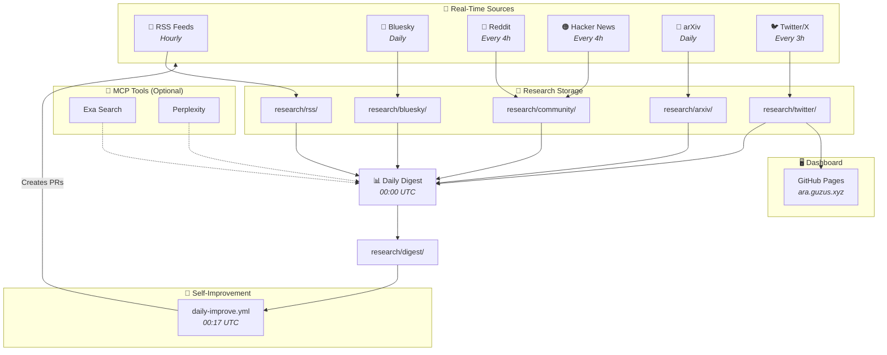

# AI Research

Automated multi-source AI news research agent powered by Claude and MCP.

## Today's Front Page

<!-- FRONT_PAGE_START -->

<!-- FRONT_PAGE_END -->

> *Generated daily at 00:30 UTC. See [`research/front-page/`](research/front-page/) for the archive.*

## Architecture



## Data Sources

| Source | Method | Frequency | Real-time? |
|--------|--------|-----------|------------|
| **Twitter/X** | bird CLI (33 accounts + 7 searches) | Every 3 hours | ✅ Yes |
| **RSS Feeds** | Direct XML fetch | Hourly | ✅ Yes |
| **Bluesky** | Public API | Daily | ✅ Yes |
| **Reddit** | RSS feeds | Every 4 hours | ✅ Yes |
| **Hacker News** | MCP Server | Every 4 hours | ✅ Yes |
| **arXiv** | MCP + RSS | Daily | ✅ Yes |
| **Web Search** | Exa/Perplexity MCP | On-demand | ✅ Yes (via MCP) |

## Workflows

```mermaid
gantt
    title Daily Workflow Schedule (UTC)
    dateFormat HH:mm
    axisFormat %H:%M

    section Hourly
    RSS Feeds           :crit, 00:00, 1h

    section Every 3h
    Twitter/X           :active, 00:07, 3h

    section Every 4h
    Community (HN+Reddit) :00:19, 4h

    section Twice Daily
    AI News Research    :08:23, 1h

    section Daily
    Bluesky             :00:11, 1h
    arXiv Papers        :06:13, 1h
    Daily Digest        :00:00, 1h
    Self-Improve        :milestone, 00:17, 0h
```



| Workflow | Schedule | Source | Output |
|----------|----------|--------|--------|
| `hourly-rss.yml` | Every hour (:30) | Official blogs, TechCrunch, arXiv RSS | `research/rss/` |
| `2h-bluesky.yml` | Daily 00:11 UTC | Bluesky AI posts | `research/bluesky/` |
| `4h-community.yml` | Every 4 hours | Reddit RSS + HN MCP | `research/community/` |
| `daily-arxiv.yml` | Daily 06:13 UTC | arXiv papers | `research/arxiv/` |
| `daily-digest.yml` | Daily 00:00 UTC | All sources + MCP search | `research/digest/` |
| `hourly-twitter.yml` | Every 3 hours | Twitter/X via bird CLI (33 accounts, 7 search queries) | `research/twitter/` |
| `ai-news-research.yml` | Twice daily (08:23, 20:23 UTC) | Perplexity/Exa MCP | `research/` |
| `daily-improve.yml` | Daily 00:17 UTC | Self-improvement | PRs with improvements |
| `research-issue.yml` | On issue label | Deep research on any topic | `research/issues/` |
| `deploy-dashboard.yml` | On push (dashboard/twitter/models changes) | Vite build + GitHub Pages deploy | GitHub Pages |

## On-Demand Research Agent

Request deep research on any topic by creating a GitHub Issue with the `research` label.

### How to Use

1. **Create a new issue** with your research question as the title
2. **Add the `research` label** to the issue
3. **Claude will automatically:**
   - Acknowledge the request with a comment
   - Search the web using multiple tools (WebSearch, Exa, Perplexity)
   - Fetch and analyze relevant documentation, articles, and code
   - Create a comprehensive research report
   - Post findings back to the issue

### Example Research Requests

| Issue Title | What Claude Researches |
|-------------|------------------------|
| "Research how to make AI UGC for my iOS app" | AI-powered user-generated content tools, SDKs, APIs for iOS |
| "Best practices for LLM fine-tuning in 2026" | Latest fine-tuning techniques, tools, and frameworks |
| "Compare vector databases for RAG applications" | Pinecone vs Weaviate vs Chroma vs Milvus comparison |
| "How to implement voice cloning ethically" | Voice synthesis APIs, legal considerations, implementation guides |

### Research Output

Reports are saved to `research/issues/{issue-number}-research.md` with:

- **Executive Summary** - Quick overview of findings
- **Key Findings** - Detailed analysis by category
- **Recommended Approaches** - Ranked options with pros/cons
- **Tools & Libraries** - Relevant SDKs, APIs, frameworks
- **Code Examples** - Working code snippets
- **Resources** - Links to docs, tutorials, repos
- **Next Steps** - Actionable recommendations

### Trigger Methods

| Method | When It Triggers |
|--------|------------------|
| Create issue with `research` label | Immediately on issue creation |
| Add `research` label to existing issue | Immediately when label is added |

## Dashboard

Live at **[ara.guzus.xyz](https://ara.guzus.xyz/)**

A single-page dashboard that displays Twitter/X research reports with:
- Warm cream/parchment color palette for readability
- Source Serif 4 body font with Inter UI headings
- Each report time slot rendered as its own card (latest first)
- Clock icon with accurate local time conversion next to UTC timestamps
- @handle highlighting with distinct pill styling
- Section navigation (up/down arrows, keyboard shortcuts)
- Date picker, search, and refresh controls
- Mobile responsive with bottom nav bar

Built with **Vite + Bun + TypeScript**, deployed via GitHub Actions to GitHub Pages. The deploy workflow triggers only on changes to `dashboard/**`, `research/twitter/**`, `research/models/**`, or `research/front-page/**`.

## Setup

### Required Secrets

| Secret | Required | Description |
|--------|----------|-------------|
| `CLAUDE_CODE_OAUTH_TOKEN` | Yes | Claude Code auth |
| `BIRD_AUTH_TOKEN` | Yes | X/Twitter auth_token cookie for bird CLI |
| `BIRD_CT0` | Yes | X/Twitter ct0 cookie for bird CLI |

### Optional API Keys (for enhanced features)

| Secret | Source | Benefit |
|--------|--------|---------|
| `EXA_API_KEY` | [dashboard.exa.ai](https://dashboard.exa.ai) | Neural web search via MCP |
| `PERPLEXITY_API_KEY` | [perplexity.ai/settings/api](https://www.perplexity.ai/settings/api) | Real-time web search with citations via MCP |

**Note:** Exa and Perplexity integrate as MCP (Model Context Protocol) tools, giving Claude enhanced web search capabilities during research workflows.

## Output Structure

```
research/
├── rss/
│   └── 2026-01-14.md              # Official blog posts, tech news
├── bluesky/
│   └── 2026-01-14.md              # Bluesky AI researcher posts
├── community/
│   ├── 2026-01-14-hn.md           # Hacker News digest
│   └── 2026-01-14-reddit.md       # Reddit real-time posts
├── arxiv/
│   └── 2026-01-14-papers.md       # Daily arXiv papers
├── twitter/
│   └── 2026-01-14.md              # Twitter updates (every 3h via bird CLI)
├── issues/
│   └── 42-research.md             # On-demand research from GitHub Issues
├── digest/
│   └── 2026-01-14-digest.md       # Daily synthesized digest (enhanced with MCP tools)
└── summaries/
    └── 2026-01-14-summary.txt     # Telegram digest summaries

dashboard/                          # Vite + Bun + TypeScript SPA
├── src/
│   ├── main.ts                    # App logic, markdown rendering, clock icons
│   └── style.css                  # Warm cream palette, responsive styles
├── index.html                     # Entry point
├── vite.config.js                 # Base path config for GitHub Pages
└── package.json                   # Dependencies (vite, marked, dompurify)
```

## Data Source Details

### Twitter/X (Every 3 hours)
Via [bird CLI](https://github.com/steipete/bird) — 33 monitored accounts, 20 tweets each, 7 search queries.

**AI Labs & Companies (11):**
OpenAI, Anthropic, Google AI, DeepMind, Mistral, Meta AI, Cohere, AI21Labs, Stability AI, Hugging Face, NVIDIA AI Dev

**Hyperscalers (7):**
Elon Musk, Sam Altman, Demis Hassabis, Logan (Google AI), Alex Albert (Anthropic), Jim Fan (NVIDIA), Roon (OpenAI)

**Researchers, Analysts & Media (15):**
Karpathy, strawberry, Curran, fin (China AI), Jukan (semiconductors), Vitrupo, sankalp, JT, Semi Analysis, Ben Thompson, The Information, Gavin Baker, Mark, NIK, Chubby

**Search queries:** AI models & products, breakthroughs, research papers, infrastructure & hardware, policy & safety, business & funding, open source & dev tools

### RSS Feeds (Hourly)
Official announcements from:
- OpenAI Blog
- Anthropic News
- Google AI Blog
- DeepMind Blog
- Meta AI Blog
- Hugging Face Blog
- TechCrunch AI
- The Verge AI
- VentureBeat AI
- arXiv CS.AI & CS.LG

### Bluesky (Daily)
Public API search for:
- AI announcements
- LLM releases
- Model discussions
- ML papers
- Key researchers (Karpathy, etc.)

### Reddit (Every 4 hours)
RSS feeds (no API key needed):
- r/MachineLearning
- r/LocalLLaMA
- r/artificial

### Hacker News (Every 4 hours)
MCP Server for:
- Top AI/ML stories
- Trending discussions

## Manual Triggers

All workflows can be triggered manually:
1. Go to Actions tab
2. Select workflow
3. Click "Run workflow"

## Self-Improvement System

The pipeline includes a **self-improving meta-workflow** (`daily-improve.yml`) that:

1. **Analyzes** yesterday's research output quality
2. **Identifies** coverage gaps and data freshness issues
3. **Searches** for new MCP servers, RSS feeds, and data sources
4. **Creates PRs** with proposed improvements

This creates a feedback loop where the system continuously improves its own methodology.

See [IMPROVEMENTS_LOG.md](./IMPROVEMENTS_LOG.md) for improvement history and future ideas.

## Resources

- [Claude Code Action](https://github.com/anthropics/claude-code-action)
- [Model Context Protocol](https://modelcontextprotocol.io/)
- [Reddit RSS Feeds](https://www.reddit.com/wiki/rss/)
- [Bluesky API Docs](https://docs.bsky.app/)
