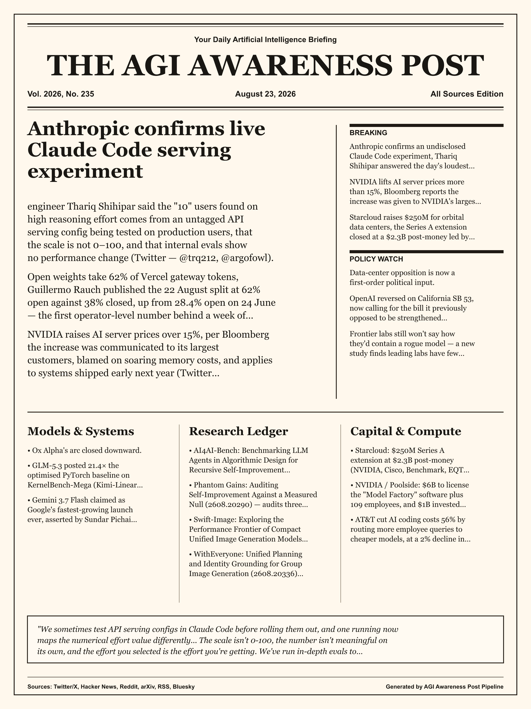
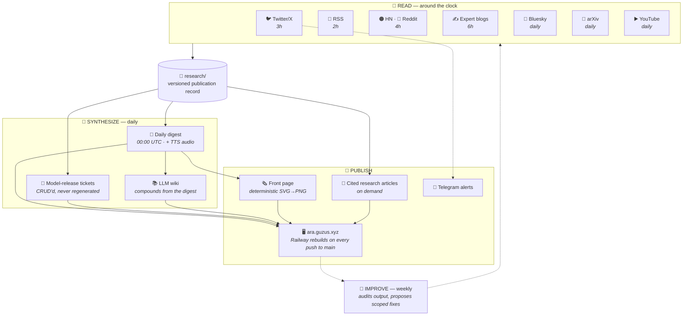
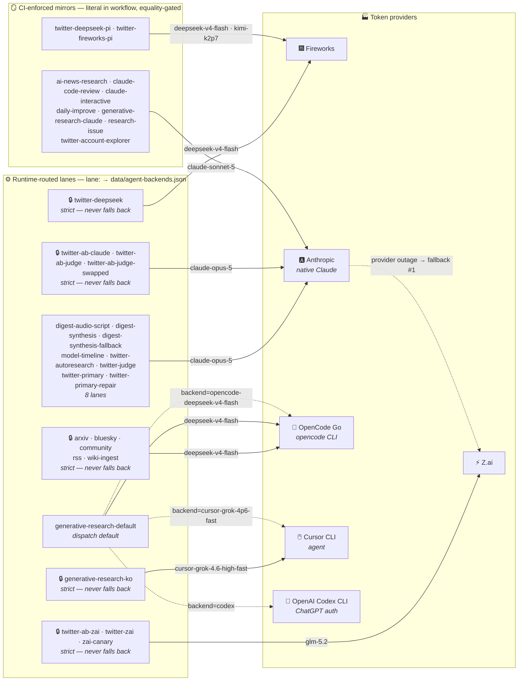

# AI Research Arm

**The AI newspaper that writes itself.** Every few hours, a fleet of LLM agents
reads the AI firehose — Twitter/X, RSS, Hacker News, Reddit, Bluesky, arXiv,
expert blogs, YouTube. Every night it writes the paper: a synthesized digest, a
rendered front page, a model-release timeline, a compounding wiki. Every week it
audits its own methodology and may open a review PR. Humans review code and
methodology changes; routine publication PRs merge automatically after their
scope and output contracts pass.

[](https://github.com/guzus/ai-research-arm/actions/workflows/ci.yml)
[](https://ara.guzus.xyz)
[](LICENSE)
[](https://github.com/guzus/ai-research-arm/commits/main)

Running unattended since January 2026. As of 2026-08-19, **32 GitHub Actions
workflow files** orchestrate the pipeline, and the repository contains **5,700+
files under `research/`** — 152 daily digests, 109 rendered front pages, 101
generative-research archive entries, 186 model-release tickets, and a 93-page
wiki. Public outputs deploy continuously to
**[ara.guzus.xyz](https://ara.guzus.xyz)**.

📖 [Why this is open source](https://guzus.substack.com/p/open-sourcing-ai-research-arm-ara) ·
[What's changed since the post](docs/since-the-open-sourcing-post.md) ·
[Operator's manual](CLAUDE.md)

## Today's Front Page

<!-- FRONT_PAGE_START -->

<!-- FRONT_PAGE_END -->

> 🗞️ Rendered after each successful daily digest — deterministic SVG→PNG, no
> model in the render path. [Interactive edition](https://ara.guzus.xyz/frontpage) ·
> [archive](research/front-page/)

## What it publishes

| Output | Cadence | Live | Source of truth |
|---|---|---|---|
| 🗞️ **Front page** — the day's digest as a newspaper | after a successful daily digest | [/frontpage](https://ara.guzus.xyz/frontpage) | [`research/front-page/`](research/front-page/) |
| 📰 **Daily digest** — all-source synthesis, with TTS audio | daily 00:00 | [/today](https://ara.guzus.xyz/today) | [`research/digest/`](research/digest/) |
| 🎫 **Model timeline** — one CRUD'd ticket per release, funding round, or legal fight | daily | [/models](https://ara.guzus.xyz/models) | [`research/models/tickets/`](research/models/tickets/) |
| 📚 **LLM wiki** — compounding knowledge base; one page per entity, concept, theme | daily, post-digest | [/wiki](https://ara.guzus.xyz/wiki) | [`research/wiki/`](research/wiki/) |
| 🔬 **Generative research** — long-form, heavily-cited articles in a custom DSL | on demand | [/research](https://ara.guzus.xyz/research) | [`research/generative/`](research/generative/) |
| 🐦 **Twitter reports** — from a reviewed, self-expanding account manifest | every 3h | [/twitter](https://ara.guzus.xyz/twitter) | [`research/twitter/`](research/twitter/) |
| 📣 **Headline alerts** — deduped breaking-news pings | every 3h | Telegram | [`research/summaries/`](research/summaries/) |

Recent articles the pipeline researched, wrote, validated, and published by
itself: *"Reward Hacking at Scale"*, *"Meta Compute: the surplus that reprices
the neocloud"*, *"Anthropic vs the Pentagon: the unprecedented
supply-chain-risk label"* — [browse all](https://ara.guzus.xyz/research).

## Quickstart (no accounts needed)

Prerequisites: Node.js 22.12+ and [Bun](https://bun.sh). The current checkout
contains no Git LFS objects; the committed sample data and front-page images
build from a normal clone.

The dashboard builds and runs against the sample research data already
committed in this repo — no API keys or secrets required:

```bash
cd dashboard
bun install --frozen-lockfile
bun run test         # dashboard data, Korean UI, rendering, and SEO contracts
bun run dev          # local dev server at http://localhost:5173
# or: bun run build  # production build into dashboard/dist/
```

Python tooling is stdlib-first and managed with [uv](https://docs.astral.sh/uv/):

```bash
uv sync --frozen --all-extras
uv run python -m unittest discover -s scripts -p 'test_*.py'
```

Running the **full data pipeline** needs your own credentials and
infrastructure — see [What you can run vs. what needs accounts](#what-you-can-run-vs-what-needs-accounts).

## Architecture

Read → synthesize → publish → improve. Published text, indexes, and front-page
artifacts are committed to git, so their history is diffable. Transient inputs,
Telegram delivery, and S3-hosted audio are explicit exceptions.


```mermaid
flowchart TB
    subgraph read["📡 READ — around the clock"]
        direction LR
        Twitter["🐦 Twitter/X<br/><i>3h</i>"]
        RSS["🔗 RSS<br/><i>2h</i>"]
        HN["🟠 HN · 🔴 Reddit<br/><i>4h</i>"]
        Blogs["✍️ Expert blogs<br/><i>6h</i>"]
        Bluesky["🦋 Bluesky<br/><i>daily</i>"]
        arXiv["📄 arXiv<br/><i>daily</i>"]
        YouTube["▶️ YouTube<br/><i>daily</i>"]
    end

    read --> store[("📁 research/<br/>versioned publication record")]

    subgraph synth["🧠 SYNTHESIZE — daily"]
        Digest["📰 Daily digest<br/><i>00:00 UTC · + TTS audio</i>"]
        Tickets["🎫 Model-release tickets<br/><i>CRUD'd, never regenerated</i>"]
        Wiki["📚 LLM wiki<br/><i>compounds from the digest</i>"]
    end

    store --> Digest
    store --> Tickets
    Digest --> Wiki

    subgraph publish["🚀 PUBLISH"]
        Front["🗞️ Front page<br/><i>deterministic SVG→PNG</i>"]
        Gen["🔬 Cited research articles<br/><i>on demand</i>"]
        TG["📣 Telegram alerts"]
        Site["🖥️ ara.guzus.xyz<br/><i>Railway rebuilds on every push to main</i>"]
    end

    Digest --> Front
    store --> Gen
    Twitter -.-> TG
    Digest --> Site
    Tickets --> Site
    Wiki --> Site
    Front --> Site
    Gen --> Site

    Improve["🔄 IMPROVE — weekly<br/><i>audits output, proposes scoped fixes</i>"]
    Site -.-> Improve
    Improve -.-> read
```

The dashboard is a Vite + Bun + TypeScript SPA. On every push to `main`,
Railway rebuilds the root [`Dockerfile`](Dockerfile) (bun build → Caddy serve,
behind Cloudflare); `dashboard/scripts/prebuild.mjs` copies the dashboard's
selected committed output directories into the site before Vite runs. There is
no deploy workflow — publishing research *is* deploying.

## Backend routing

Which model serves each lane — and where it falls back on a provider
outage — is defined in one file:
[`data/agent-backends.json`](data/agent-backends.json). `agent-run` lanes
resolve it at runtime; container/native mirror lanes pin the same route in
their workflow and CI checks equality. The diagram below is generated from
the SSOT so it cannot drift. Full per-lane matrix:
[`docs/backend-matrix.md`](docs/backend-matrix.md).

<!-- BEGIN GENERATED BACKEND DIAGRAM (scripts/build_backend_matrix.py — do not edit by hand) -->

```mermaid
flowchart LR
    subgraph runtime["⚙️ Runtime-routed lanes — lane: → data/agent-backends.json"]
        lanes0["digest-audio-script · digest-synthesis · digest-synthesis-fallback<br/>model-timeline · twitter-autoresearch · twitter-judge<br/>twitter-primary · twitter-primary-repair<br/><i>8 lanes</i>"]
        strict0["🔒 twitter-ab-claude · twitter-ab-judge · twitter-ab-judge-swapped<br/><i>strict — never falls back</i>"]
        strict1["🔒 generative-research-ko<br/><i>strict — never falls back</i>"]
        strict2["🔒 twitter-deepseek<br/><i>strict — never falls back</i>"]
        strict3["🔒 arxiv · bluesky · community<br/>rss · wiki-ingest<br/><i>strict — never falls back</i>"]
        strict4["🔒 twitter-ab-zai · twitter-zai · zai-canary<br/><i>strict — never falls back</i>"]
        gendef["generative-research-default<br/><i>dispatch default</i>"]
    end
    subgraph mirrors["🪞 CI-enforced mirrors — literal in workflow, equality-gated"]
        pi["twitter-deepseek-pi · twitter-fireworks-pi"]
        native["ai-news-research · claude-code-review · claude-interactive<br/>daily-improve · generative-research-claude · research-issue<br/>twitter-account-explorer"]
    end
    subgraph providers["🏭 Token providers"]
        FW["🎆 Fireworks"]
        ZAI["⚡ Z.ai"]
        ANT["🅰️ Anthropic<br/><i>native Claude</i>"]
        OC["🚀 OpenCode Go<br/><i>opencode CLI</i>"]
        CUR["🖱️ Cursor CLI<br/><i>agent</i>"]
        OAI["🤖 OpenAI Codex CLI<br/><i>ChatGPT auth</i>"]
    end
    lanes0 -->|"claude-opus-5"| ANT
    strict0 -->|"claude-opus-5"| ANT
    strict1 -->|"cursor-grok-4.6-high-fast"| CUR
    strict2 -->|"deepseek-v4-flash"| FW
    strict3 -->|"deepseek-v4-flash"| OC
    strict4 -->|"glm-5.2"| ZAI
    gendef -->|"deepseek-v4-flash"| OC
    pi -->|"deepseek-v4-flash · kimi-k2p7"| FW
    native -->|"claude-sonnet-5"| ANT
    gendef -.->|"backend=codex"| OAI
    gendef -.->|"backend=opencode-deepseek-v4-flash"| OC
    gendef -.->|"backend=cursor-grok-4p6-fast"| CUR
    ANT -. "provider outage → fallback #1" .-> ZAI
```
_Generated from [`data/agent-backends.json`](data/agent-backends.json) — fallback chain: `claude` → `zai-glm-5p2`; regenerate with `uv run python scripts/build_backend_matrix.py`._
<!-- END GENERATED BACKEND DIAGRAM -->

## Sources

| Source | Method | Frequency |
|--------|--------|-----------|
| **Twitter/X** | Birdy read-only multi-fetch (reviewed account manifest + 7 searches) | Every 3 hours |
| **RSS feeds** | Direct XML fetch (OpenAI, Anthropic, DeepMind, TechCrunch, …) | Every 2 hours |
| **Hacker News** | Algolia HN Search API | Every 4 hours |
| **Reddit** | RSS feeds (r/MachineLearning, r/LocalLLaMA, r/artificial) | Every 4 hours |
| **Expert blogs** | Curated KOL/researcher/operator feed registry; selected feeds also emit GUID-deduplicated Telegram alerts | Every 6 hours (subscriptions every 2 hours) |
| **Bluesky** | Public API | Daily |
| **arXiv** | Direct Atom API (plus RSS in the RSS lane) | Daily |
| **YouTube** | tuber API discovery + read-only summaries/transcripts | Daily |
| **Web search** | Exa/Perplexity MCP (optional) | On demand |

The Twitter account manifest ([`data/sources/twitter_accounts.json`](data/sources/twitter_accounts.json))
is itself agent-curated: a weekly explorer lane scouts for high-signal
accounts — favoring ones vouched for by accounts already monitored, and
on-topic for AI over merely viral — and opens a reviewed PR when the evidence
is strong. Contract: [`docs/twitter-account-curation.md`](docs/twitter-account-curation.md).

## Workflows

All 32 workflows live in [`.github/workflows/`](.github/workflows/). The
interesting ones:

**Aggregate** — raw signal in, markdown out

| Workflow | Schedule | Output |
|---|---|---|
| `hourly-twitter.yml` | every 3h | `research/twitter/` + Telegram headline alerts (plus DeepSeek/pi comparison tiers) |
| `hourly-rss.yml` | every 2h | `research/rss/` |
| `4h-community.yml` | every 4h | `research/community/` (HN + Reddit) |
| `daily-ai-blogs.yml` | every 6h | `research/blogs/` |
| `blog-subscriptions.yml` | every 2h | Telegram alerts + `research/summaries/blog-subscriptions.json` GUID state |
| `2h-bluesky.yml` | daily | `research/bluesky/` |
| `daily-arxiv.yml` | daily | `research/arxiv/` |
| `daily-youtube.yml` | daily | `research/youtube/` |
| `daily-earnings.yml` | weekdays, before the digest | `research/earnings/` (SEC EDGAR earnings filings for AI-exposed issuers; one file per event, nothing on a quiet day) |
| `twitter-account-explorer.yml` | weekly | reviewed PRs against the account manifest |

**Synthesize** — read everything, write the record

| Workflow | Schedule | Output |
|---|---|---|
| `daily-digest.yml` | daily 00:00 UTC | `research/digest/` + TTS audio |
| `24h-model-timeline.yml` | daily | CRUDs `research/models/tickets/` + daily diff |
| `wiki-ingest.yml` | after the digest | updates `research/wiki/` from the *curated* synthesis |
| `ai-news-research.yml` | twice daily | broad topic sweep via Perplexity/Exa MCP |

**Publish** — shareable artifacts

| Workflow | Trigger | Output |
|---|---|---|
| `daily-front-page.yml` | after a successful daily digest | newspaper PNG + interactive edition |
| `generative-research.yml` | issue label or dispatch | long-form cited article |
| `translate-generative-research.yml` | manual dispatch | validated Korean article translation via review PR |
| `research-issue.yml` | `research` issue label | report posted back to the issue |

**Keep it honest** — the pipeline watching itself

| Workflow | Trigger | Purpose |
|---|---|---|
| `daily-improve.yml` | weekly Mon | audits output; opens a methodology PR when it finds a scoped change |
| `liveness-check.yml` | scheduled | per-lane freshness watchdog, runs on *both* runner tiers |
| `auto-rerun-on-runner-loss.yml` | on failure | re-runs jobs whose runner vanished (loop-capped) |
| `ci.yml` | push/PR | actionlint + dashboard tests/typecheck/build + Python tests and data validators |
| `claude.yml` / `claude-code-review.yml` | `@claude` / PR | interactive agent + automated review |

Exact cron expressions and event dependencies live in the workflow YAML; the
tables above describe cadence without duplicating a second schedule that can
drift.

## Research on demand

Three ways maintainers and trusted collaborators can commission work from the
pipeline:

**1. Issue → research report.** A repository owner, member, or collaborator
opens an issue and adds the `research` label. The agent acknowledges it,
researches with web search + MCP tools, commits a report to `research/issues/`,
and posts the findings back on the issue.

**2. Topic → published article.** A trusted issue author uses the
`gen-research` label, or a maintainer dispatches `generative-research.yml` with
a `topic`. The agent researches primary sources, writes in the
[ARA DSL](ARA_DSL.md) (a validated component language — see
[Component catalog](COMPONENTS.md)), and publishes through a single writer
path that re-validates everything before commit. The SSOT default is DeepSeek
V4 Flash via OpenCode Go; explicit selectors also expose native Claude, Codex,
Cursor, and Fireworks routes
([details](docs/generative-research-backends.md)).

**3. Tweet → verified article.** Give it just a tweet URL — it reads the
thread, infers the underlying research question, then verifies the claims
against independent primary sources before writing:

```bash
gh workflow run generative-research.yml \
  -f twitter_url="https://x.com/<handle>/status/<id>"
```

## Built to keep running

The interesting engineering is less "call an LLM" and more "survive every way
this can break":

- **Fail-closed publishing.** Scheduled editorial lanes must prove fresh
  agent-authored output. If the agent path writes nothing or produces
  sub-floor content, the workflow goes red. The daily digest is the deliberate
  exception: it may publish a clearly labelled deterministic fallback rather
  than leave the front page blank.
- **Output contracts.** Agent lanes must *prove* their work:
  [`require-output`](.github/actions/require-output) asserts the expected
  artifacts changed, and [`require-diff-scope`](.github/actions/require-diff-scope)
  asserts nothing outside the declared paths was committed.
- **Sandboxed agents.** Native Claude lanes use a fail-closed bubblewrap policy
  ([`.claude/settings.json`](.claude/settings.json)). OpenCode and Cursor lanes
  run as non-root users in locked-down containers and import only validated
  output from disposable clones.
- **Provider routing.** One SSOT maps lanes across OpenCode, Cursor, Fireworks,
  Z.ai, Anthropic, and Codex, including strict routes and ordered fallbacks —
  and CI fails if the generated docs or workflow mirrors drift from it.
- **Watchdogs that outlive the fleet.** Freshness checks run on both runner
  tiers so an outage on either still alerts; a loop-safe auto-rerunner
  recovers jobs whose runner vanished mid-run.
- **CRUD, not regenerate.** The model timeline and wiki are persistent stores
  with immutable slugs and append-only history, schema-validated on every PR
  that changes them — knowledge compounds instead of being rewritten nightly.
- **Self-improvement with review.** The weekly improve lane reads the
  pipeline's own output and may open a scoped methodology PR; it makes no
  change when the evidence does not justify one, and a human decides whether
  to merge proposals.

## What you can run vs. what needs accounts

This repo is one person's live pipeline, published as-is. Much of it is
reproducible; some of it points at the maintainer's private infrastructure and
is included for transparency rather than turnkey reuse.

**Runs with no accounts:**
- The **dashboard** — builds and serves from the sample data committed under
  `research/` (see [Quickstart](#quickstart-no-accounts-needed)).
- The **Python tooling + tests** — stdlib-first, `uv`-managed; validators and
  unit tests need no service accounts after dependencies are installed.

**Needs your own credentials and compatible runners/services:**
- **Claude / Codex / OpenCode / Cursor / Fireworks / Z.ai backends** — set
  `CLAUDE_CODE_OAUTH_TOKEN`, `CODEX_AUTH_JSON`, `OPENCODE_API_KEY`,
  `CURSOR_API_KEY`, `FIREWORKS_API_KEY`, or `ZAI_API_KEY` for the
  synthesis/generative lanes you want to run on your fork. The Codex lane
  uses ChatGPT-managed auth, not OpenAI API billing; the OpenCode lane
  authenticates the opencode CLI with a plain env-var key against the
  OpenCode Go subscription; the Cursor lane authenticates the official
  `agent` CLI with `CURSOR_API_KEY`.
- **Twitter/X lanes** — supply either `BIRDY_ACCOUNTS` or both
  `BIRD_AUTH_TOKEN` / `BIRD_CT0` cookies. Auth setup fails fast if neither
  route is complete; after setup, individual fetch errors degrade to empty
  data so one expired account does not crash the whole aggregation pass.
- **Exa / Perplexity** search enrichment and **Gemini** TTS are optional.

**Maintainer-specific (swap or disable to self-host):**
- **Runners:** nearly every workflow targets the maintainer's private
  self-hosted Linux runner (`runs-on: [self-hosted, Linux]`); on a fork those
  jobs queue until you register your own runner (or change `runs-on`). The old
  Cloud Run fleet is paused rollback infrastructure, not the production path.
- **Services:** `hooker.guzus.xyz` (telemetry — no-ops if `HOOKER_URL` is
  unset), `tuber-api.guzus.xyz` (YouTube signal — no public equivalent), and
  `s3.guzus.xyz` (audio hosting). Override the non-secret endpoints via the env
  vars in [`.env.example`](.env.example) (`AUDIO_BASE_URL`,
  `POSTBUILD_SITE_ORIGIN`, `DEPLOY_HEALTH_URL`, …).
- **Deploy:** production is a Railway service watching `main`, and
  `ara.guzus.xyz` is the maintainer's domain. The static dashboard shell also
  embeds a Google Analytics tag in `dashboard/index.html` — remove it on a fork.
- **Sibling repos** `../oracle` and `../runner` referenced in the docs are
  private and not required for the no-account Quickstart or hosted-provider
  workflows.

### Secrets

All credentials are injected via GitHub Actions secrets (or a local `.env`,
which is gitignored) — see [`.env.example`](.env.example) for the common local
settings and service overrides. None are needed for the
[Quickstart](#quickstart-no-accounts-needed).

| Secret | Required for | Description |
|--------|--------------|-------------|
| `CLAUDE_CODE_OAUTH_TOKEN` | native-Claude lanes, fallback path, reserved dispatcher plumbing | Claude Code auth; current host-checkout agent-run is incompatible with the editorial dispatcher |
| `FIREWORKS_API_KEY` | Fireworks generative and comparison routes | Anthropic-compatible Fireworks endpoint for explicit model routes and comparison lanes |
| `ZAI_API_KEY` | Z.ai GLM 5.2 lanes and fallback chain | Z.ai Coding Plan key; current second provider in the global fallback chain and used by Z.ai canaries/comparison lanes |
| `CODEX_AUTH_JSON` | `generative-research backend=codex` | file-backed ChatGPT Codex auth from `codex login`; treat like a password |
| `OPENCODE_API_KEY` | OpenCode profiles, direct comparison/canary paths, dispatcher route plumbing | OpenCode Go key. The five editorial lanes use it while their shared route selects the current strict OpenCode profile; then they share its plan caps. |
| `CURSOR_API_KEY` | Cursor CLI profiles, direct comparison/canary paths, dispatcher route plumbing | Cursor dashboard API key. Prewired so an SSOT-only switch to `cursor-grok-4p6-fast` needs no workflow edit. Production defaults stay on OpenCode. |
| `BIRD_AUTH_TOKEN` / `BIRD_CT0` | Twitter/X lanes | X cookies (read-only use; expire often) |
| `BIRDY_ACCOUNTS` | alternative to cookie pair | multi-account rotation JSON; every account forced read-only |
| `GEMINI_API_KEY` | digest/article audio | price-performant TTS |
| `EXA_API_KEY` / `PERPLEXITY_API_KEY` | optional | neural + cited web search via MCP |
| `TELEGRAM_BOT_TOKEN` / `TELEGRAM_CHAT_ID` | blog alerts, digests, liveness escalation | delivery channel |

<details>
<summary>Output directory layout</summary>

```
research/
├── arm/            # dashboard-facing agent timeline
├── arxiv/          # daily papers
├── audio/          # zero-byte date stubs; generated audio lives on S3
├── blogs/          # expert-blog digests
├── bluesky/        # supplemental commentary
├── community/      # HN + Reddit digests
├── claims/         # cross-article verified-claim index
├── digest/         # the daily synthesis (+ audio stubs; mp3s on S3)
├── earnings/       # AI-issuer earnings events from SEC EDGAR (per event, not per day)
├── front-page/     # newspaper PNG + interactive edition
├── generative/     # long-form articles, translations, claim ledgers, and index
├── issues/         # on-demand issue research
├── market/         # deterministic GPU and model-price datasets
├── models/tickets/ # persistent model-release tickets
├── rss/            # raw-signal digests
├── summaries/      # Telegram digests + alert/subscription ledgers
├── twitter/        # 3-hourly reports
├── wiki/           # the compounding knowledge base
├── wiki-translations/ko/ # validated Korean wiki mirrors
└── youtube/        # tuber signal lane
```

</details>

## Repository map

| Path | What it is |
|---|---|
| [`CLAUDE.md`](CLAUDE.md) | The operator's manual — load-bearing rules, lane contracts, failure modes |
| [`ARA_DSL.md`](ARA_DSL.md) + [`ARA_CATALOG.json`](ARA_CATALOG.json) + [`COMPONENTS.md`](COMPONENTS.md) | The article component language: source format, machine catalog, human reference — kept in lockstep by CI |
| [`data/agent-backends.json`](data/agent-backends.json) | Single source of truth for model routing + fallback chains |
| [`scripts/`](scripts/) | 109 Python modules: 65 implementation tools and 44 test modules, plus the JavaScript front-page renderer |
| [`docs/`](docs/) | Contracts and deep dives: [backend matrix](docs/backend-matrix.md), [model tickets](docs/model-tickets.md), [wiki schema](docs/wiki-schema.md), [headline dedup](docs/headline-dedupe.md), [AI industry map](docs/ai-industry-map.md), [OKF export](docs/okf.md) |
| [`dashboard/`](dashboard/) | Vite + Bun + TypeScript SPA behind ara.guzus.xyz |
| [`prompts/`](prompts/) | Agent prompts for the scheduled lanes |

## License

The **source code** in this repository (scripts, workflows, the dashboard, and
documentation) is released under the [MIT License](LICENSE).

The **contents of `research/`** are a different matter: they are automated
excerpts, summaries, and reproductions of third-party material (news articles
and posts from X/Twitter, Hacker News, Reddit, Bluesky, arXiv, and similar
sources) produced as the pipeline's output. They are **not** relicensed by the
MIT grant and remain the property of their original authors. If you reuse
anything under `research/`, you are responsible for complying with the original
sources' terms — including the X/Twitter Terms of Service and each publisher's
copyright.

Contributing: [`.github/CONTRIBUTING.md`](.github/CONTRIBUTING.md) ·
Security: [`.github/SECURITY.md`](.github/SECURITY.md)
