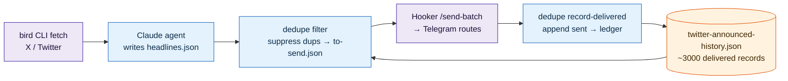
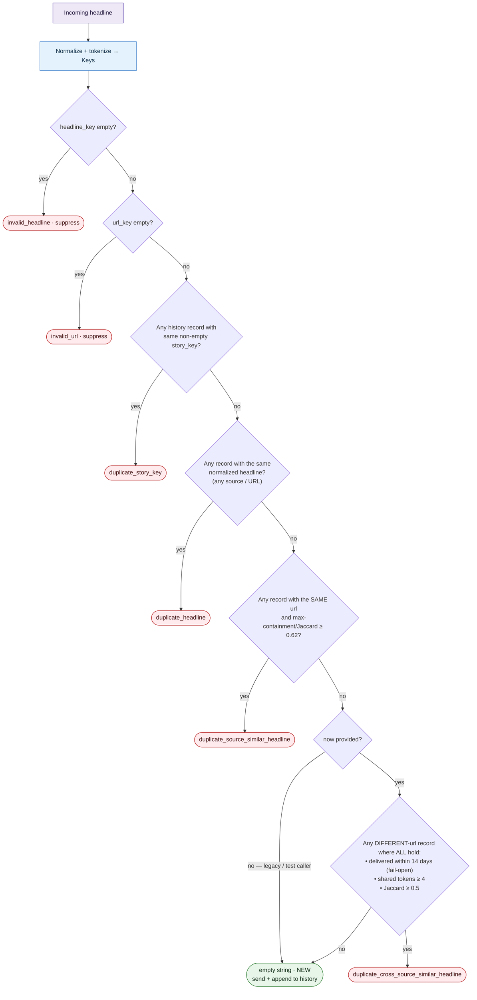
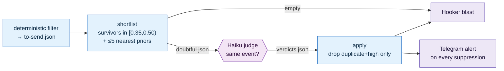

# Twitter headline-alert deduplication

How the hourly-twitter cron keeps from re-sending the **same story** to the
Telegram / Hooker "Robot Colosseum" feed. This is the contract for
[`scripts/dedupe_headline_alerts.py`](../scripts/dedupe_headline_alerts.py)
and its tests in `scripts/test_dedupe_headline_alerts.py`.

## What problem it solves

Each cycle a fresh Claude agent reads a window of X/Twitter signal and emits
3–7 punchy headlines (`research/summaries/<date>-twitter-<hour>h-headlines.json`).
The agent has **no memory of prior cycles**, so without a cross-cycle guard the
same event gets blasted again every time a new account reports it — e.g. the
same hire announced by two outlets hours apart. Dedup is therefore the
**only** place cross-cycle and cross-source repetition can be caught.

It is intentionally an **alert-send ledger, not a global news store**: the only
question it answers is "have we already alerted users about this story?"

## Where it runs in the pipeline



Two `dedupe_headline_alerts.py` subcommands bracket the send:

| Subcommand | When | Effect |
|---|---|---|
| `filter` | before the blast | Drops every incoming headline that duplicates a ledger record; writes the survivors to `to-send.json`. |
| `record-delivered` | after the blast | Appends the headlines that **actually delivered** (≥1 route accepted) to the ledger, capped at `RETENTION_DEFAULT = 3000` records. |

The ledger (`research/summaries/twitter-announced-history.json`) is committed
back to `main` each cycle, so the next run sees the updated history. Each
record is `{headline, source, url, category, delivered_at}` where
`delivered_at` is `"YYYY-MM-DD HH:MM UTC"`.

## The decision: `duplicate_reason(item, history, history_keys, now)`

Returns a **reason string** (suppress) or `""` (new → send). Checks run in
**priority order; first match wins**, so the cheap high-precision signals
short-circuit before the fuzzy cross-source scan.



### Layers, in priority order

| # | Reason returned | Condition | Catches |
|---|---|---|---|
| — | `invalid_headline` / `invalid_url` | empty normalized headline or URL | malformed agent output |
| 1a | `duplicate_story_key` | same non-empty `story_key` | explicit story grouping (**inert today** — the agent's schema emits no `story_key`; kept for when it does) |
| 1b | `duplicate_headline` | identical **normalized** headline, **any** source | verbatim re-posts / cross-account copies |
| 1c | `duplicate_source_similar_headline` | **same URL** + `max(containment, jaccard) ≥ 0.62` | one author rephrasing their own tweet |
| 2 | `duplicate_cross_source_similar_headline` | **different URL** + in 14-day window + `≥ 4` shared tokens + `Jaccard ≥ 0.5` | **the same story from a different account, paraphrased** (the leak this layer was added to close) |

**Normalization** (`normalize_headline`): NFKC, uppercase, strip URLs, drop
non-decimal dots, collapse to `[A-Z0-9.$]`. **Tokens** (`headline_tokens`):
the normalized words minus a stopword list, length > 1. Token sets are
precomputed once per record and cached on `Keys.tokens`, so the Pass-2 scan
never re-tokenizes history.

## Tunable constants (defaults live in the script — no workflow change to tune)

| Constant | Value | Meaning |
|---|---|---|
| `URL_SIMILARITY_THRESHOLD` | `0.62` | Pass 1c — same-URL paraphrase floor (uses `max(containment, jaccard)`). |
| `CROSS_SOURCE_JACCARD_THRESHOLD` | `0.5` | Pass 2 — cross-source similarity floor (**Jaccard only**). |
| `CROSS_SOURCE_MIN_OVERLAP` | `4` | Pass 2 — minimum absolute shared significant tokens. |
| `CROSS_SOURCE_WINDOW_DAYS` | `14` | Pass 2 — recency window; `≤ 0` means unbounded. |
| `RETENTION_DEFAULT` | `3000` | Ledger cap kept by `record-delivered`. |

## Three design decisions that matter

1. **Pass 2 uses Jaccard, not `max(containment, jaccard)`.** Containment
   (`overlap / smaller-set`) scores a short headline that is a token-subset of
   a longer one at **1.0** — so a legitimate *appended-fact follow-up*
   (`"META RELEASES LLAMA 5"` → `"…WITH 2M TOKEN CONTEXT AND NATIVE VOICE"`)
   would be wrongly suppressed. Jaccard (`overlap / union`) penalizes the size
   gap (0.375 there), letting genuine "more details" updates through. Pass 1c
   keeps the looser `max()` because an identical URL already proves same source.

2. **Pass 2 is inert without `now`.** The recency window needs a reference
   time. When `duplicate_reason` is called with no `now` (the 2-arg legacy/test
   signature), Pass 2 is skipped entirely — existing callers are byte-for-byte
   unchanged. `filter_headlines` derives `now` from the run `--timestamp`; if
   that is malformed, Pass 2 simply doesn't run (no crash).

3. **Per-record timestamps fail OPEN.** A history record whose `delivered_at`
   is missing or unparseable is treated as **outside** the window → it cannot
   suppress an incoming alert. The cost of a parse bug is at worst one
   duplicate, never a swallowed headline. (Whole-file JSON corruption still
   fails **closed** — `load_json_list` raises `SystemExit`.)

**In-batch behavior:** `filter_headlines` appends each accepted item back into
`history` (stamped with the run `now`) as it iterates, so two paraphrases of
the same story *in the same cycle* from different accounts collapse to one —
the first survives, the second is caught by Pass 2.

## Calibration & known residual

Thresholds were calibrated against the **real delivered-alert ledger**: genuine
cross-source re-reports cluster at `Jaccard ≥ ~0.5` with `≥ 7` shared tokens,
while appended-fact progression and short-subset headlines fall well below.
The ledger's Jaccard *ceiling* is ~0.65, which is why `0.5` — not an intuitive
`0.7+` — is the correct cut. A replay of the full ledger showed ~2.4% of
delivered alerts were cross-source repeats this layer now catches.

**Residual (documented, not solved by the deterministic layer):** token overlap
cannot separate two genuinely-distinct stories that share heavy vocabulary (two
entities running the same templated beat) from a true re-report. That residual
is exactly what the **agent-in-the-loop gate** below addresses.

## Agent-in-the-loop final gate

The residual above is the gate's whole reason to exist. In the contested band
*just below* the cross-source floor — `[0.35, 0.50)` Jaccard, ≥ 3 shared
tokens — token overlap can't tell a true cross-source re-report from distinct
news that merely shares vocabulary. Calibration on the real ledger shows that
band is ~half true duplicates that leaked and ~half genuinely-distinct items:
"MICRON CROSSES $900B" vs "SK HYNIX CROSSES $900B" (same metric, different
subject), appended-fact follow-ups, running-counter progressions. Separating
those is a *semantic* judgment, so a Claude **Haiku** step adjudicates exactly
that band — and only that band — as a final gate on the send path.

It lives in `scripts/headline_judge.py` (two deterministic, unit-tested
subcommands) bracketing one model step in `hourly-twitter.yml`:



**Safety contract** (the gate enforces immediately, with no shadow phase):

- **One direction only.** The judge turns a would-be *send* into a *suppress* —
  never the reverse, and never inside the deterministic exact / same-URL / ≥0.5
  layers. It arbitrates only the sub-floor band.
- **Default-keep.** A headline is dropped *only* on an explicit
  `verdict:"duplicate"` + `confidence:"high"`. Any other verdict, a missing
  verdict, or a missing/garbled verdicts file keeps it in the send set
  (**fail OPEN** — never silently eat a real alert on a model hiccup).
- **Distinct-protection prompt.** The judge is told *same action/number,
  different subject = distinct* and *appended-fact follow-up = distinct*, with
  "when in doubt, keep" as the cardinal rule. Validated against a fixture of
  real band cases (`scripts/testdata/judge_eval_cases.json`): zero distinct
  items eaten.
- **URL-keyed.** Verdicts match headlines by URL, not array position, so a
  reordered or partial model response can't misattribute a suppression.
- **Visible audit.** Every suppression is posted to Telegram (via hooker), so a
  wrong eat is reviewable within hours — this stands in for a shadow phase.
- **Cheap.** ~0–1 shortlisted headline per cycle (≈6% of the feed sits in the
  band); the model step is skipped entirely when the shortlist is empty.

### Gate constants (`scripts/headline_judge.py`)

| Constant | Value | Meaning |
|---|---|---|
| `SHORTLIST_BAND_LOW` | `0.35` | lower edge of the contested band the judge sees |
| `SHORTLIST_BAND_HIGH` | `0.50` | upper edge (= the deterministic cross-source floor) |
| `SHORTLIST_MIN_OVERLAP` | `3` | minimum shared tokens to shortlist a survivor |
| `SHORTLIST_MAX_CANDIDATES` | `5` | nearest priors shown to the judge per headline |

## How to verify

```bash
# Unit + behavior tests (also run in CI via unittest discover) — covers both
# the deterministic dedupe and the judge shortlist/apply logic.
uv run python -m unittest discover -s scripts -p 'test_*.py'

# Backtest: replay the real ledger and count cross-source dups the
# current logic would catch (see the PR description for the script).

# Judge prompt smoke-test: run the prompt over the labeled hard-case fixture
# (scripts/testdata/judge_eval_cases.json) and confirm ZERO distinct items are
# eaten before enabling enforcement.
```

When changing thresholds or the layer order, re-run the tests and re-backtest
against the live ledger before shipping — over-suppression silently drops real
news, which is worse than an occasional duplicate.
